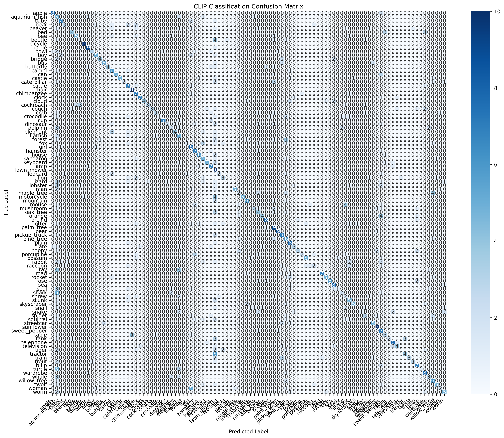

# 🧠 Zero-Shot Image Classification with CLIP

A dynamic, zero-shot image classification system powered by OpenAI's CLIP model. This system supports real-time inference and dynamic class expansion **without retraining**.

---

## 🚀 Features

* 🔍 **Zero-shot learning** using natural language class descriptions
* 📦 **Dynamic class addition** at runtime – no retraining required
* 📊 **Top-1 & Top-5 predictions** with confidence scores
* 📉 Built-in **evaluation module** with metrics & visual output
* 🌐 Optional **Streamlit interface** for live demo and user uploads

---

## 🖼️ Model Performance Showcase

Confusion matrix and other evaluation results:

<p align="center">
  
</p>

> 📂 Detailed evaluation results available in `evaluation_results.json`.

---

## 🛠️ Setup

Clone the repo and install the dependencies:

```bash
git clone https://github.com/yourusername/CLIP-Zero-Shot-Classifier.git
cd CLIP-Zero-Shot-Classifier
pip install -r requirements.txt
```

---

## 🧪 Run Inference

To classify new images using CLIP:

```bash
python CLIP_classifier.py
```

Make sure your class descriptions are defined in `class_descriptions.py`.

---

## 🌐 Launch the Web UI (Optional)

If you want a user-friendly UI using Streamlit:

```bash
streamlit run CLIP_classifier.py
```

Upload your image and get top-5 predicted labels instantly!

---

## 🗒️ Files Overview

| File                      | Purpose                                         |
| ------------------------- | ----------------------------------------------- |
| `CLIP_classifier.py`      | Main script for inference and Streamlit UI      |
| `Data_collection.py`      | Utility for gathering and preprocessing data    |
| `class_descriptions.py`   | Descriptions of dynamic classes                 |
| `evaluation_results.json` | Performance metrics (accuracy, precision, etc.) |
| `confusion_matrix.png`    | Visualization of model accuracy                 |
| `requirements.txt`        | Dependency list for setup                       |

---

## 👤 Author

**Gourab Chakraborty**
[GitHub](https://github.com/Gourabbabu) • [LinkedIn](#) *(optional)*

---

## 📌 Use Cases

* 🔍 Open-domain image classification
* 🛒 E-commerce categorization
* 🔐 Surveillance & security systems
* 🧠 Educational AI experiments

---


## 🌟 Star this repo if you found it helpful!
